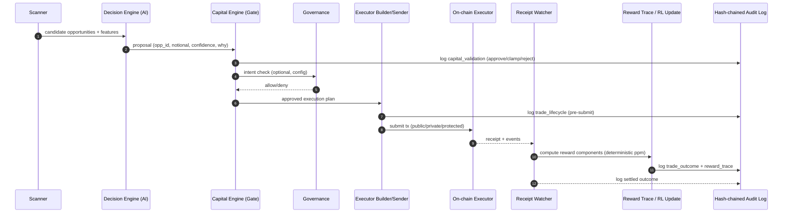
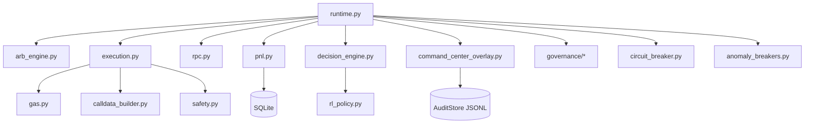

# x∆v — Sovereign Capital

This repo contains an end-to-end **off-chain arbitrage runtime** (scanner → decision → execution → receipts) plus a premium **Expo React Native** operator app branded as **x∆v — Sovereign Capital**.

> Default posture is **safe & non-custodial**: the backend returns tx data (**txdata mode**) and an external wallet signs transactions via WalletConnect.

---

# Sovereign Capital Command Center (NEW BASELINE)

This export upgrades the mobile app into a **Sovereign Capital Command Center**:

- **Instant situational awareness** (Home/Capital/AI/Risk/Lab/Analytics/Governance tabs)
- **Explainability first**: decision feeds, “Explain My Capital”, and per-move rationale drilldowns
- **Risk-first controls**: kill switches, sandbox-only mode, allocation freeze, defensive clamps
- **Auditability**: append-only **hash-chained** audit events (local-first in backend)

## v1 Production Scope (Hard Lock)

This build is **intentionally scoped to ONE production focus**:

✅ **Flash-loan atomic arbitrage** (`execution.v1_focus = flashloan_atomic`)

Other engines (cross-exchange arb, funding capture, MEV execution) remain **disabled by default** until the v1 edge is statistically proven.

## Assumptions & Ambiguities (documented)

- **USD NAV series:** `/api/commandcenter/snapshot` uses `realized_profit_after_gas_usd_micro` from the PnL store when available. If USD pricing is not available on your chain/config, NAV may display `0.0` (analytics-only). This does **not** affect trading logic.
- **Sandbox/Probation:** the UI supports probation staging and mutation proposals, but backend promotion/mutation is gated and should remain OFF for v1.
- **Deterministic replay:** the runtime can now export immutable replay bundles per attempted trade with block context, calldata inputs, quotes, gas assumptions, controls, and receipt outcomes. Replay export is config-gated and defaults to OFF for safety.

## Execution Capture Layer (Execution-First Upgrade)

This export upgrades the runtime from a simple opportunity detector into a **probabilistic execution capture machine**.

New backend package: `backend/victor_ai_bot/execution_capture/`

Core modules:
- `OpportunityEnvelope` — normalized opportunity with latency, fragility, copy-risk, simulation confidence, and safe-size curve
- `CaptureScoreEngine` — estimates realized edge using success/freshness/interference/venue-quality terms
- `ExecutionLaneRouter` — routes each trade into `PUBLIC`, `PROTECTED`, `PRIVATE`, or `DROP`
- `SizeOptimizer` — sizes for best realized value, not max nominal pnl
- `ExecutionTelemetryStore` — feeds route/venue/lane outcomes back into future scoring
- `ExecutionDecisionEngine` — emits a single auditable execution decision used by downstream tx submission
- `RouteTemplateCache` — remembers hot route families for lower-latency repeated execution

Interpretable scoring model:

```
expected_realized_value =
  expected_profit_usd
  * success_probability
  * freshness_probability
  * non_interference_probability
  * venue_quality
  - gas_estimate_usd
  - slippage_cost_estimate
  - latency_decay_cost
  - expected_failure_cost
```

Safety defaults:
- low-confidence or stale opportunities are dropped
- public deployments drop high-copy-risk routes rather than leaking them to the mempool
- private/protected lanes are preferred for fragile routes
- sizing is shrink-first under fragility, low confidence, or poor telemetry

## Regime / evolution / wealth controls (deterministic)

This export also adds deterministic overlays for evolution and profitability coordination:

- **Regime engine** classifies `high_volatility`, `low_volatility`, `gas_spike`, `low_liquidity`, `bull`, `bear`, `balanced`
- **Structural evolution** extends mutation beyond parameters into signal, entry, exit, timing, and crossover metadata
- **Robustness testing** evaluates liquidity shocks, gas spikes, slippage expansion, and noise injection before promotion
- **Lifecycle staging** tracks `experimental -> paper_trading -> production -> degraded -> retired`
- **Strategy memory + genealogy** preserve parentage, mutation history, regime tags, and performance drift clues
- **Aggression mode** is deterministic and mobile-controlled: `conservative | balanced | aggressive`
- **Full system enable** is mobile-controlled, but still bounded by governance/risk gates rather than bypassing them

Mobile/backend integrations completed in this export:
- sandbox/meta apply flow now uses backend candidate endpoints
- defensive stress screen now calls a live backend stress endpoint
- analytics tab now renders lane-success and venue-quality series from execution telemetry

## New Command Center API (Additive)

- `GET /api/commandcenter/snapshot` — unified snapshot for all mobile tabs
- `POST /api/commandcenter/control` — apply controls (admin-only)
- `GET /api/commandcenter/audit/tail?limit=200` — hash-chained audit log
- `GET /api/commandcenter/explain` — “Explain My Capital” response

## Off-ramp: Convert → Withdraw (USDC/USDT)

The mobile Capital tab includes an **Off-Ramp** screen that can:
- deterministically **quote** `token_in → USDC/USDT` via UniV3 QuoterV2
- build **convertAndWithdraw** calldata (`/api/withdraw/convert/prepare`) for external signing
- optionally **execute** via backend hot-signing when `execution.withdraw_mode = backend` (not recommended for public deployments)

New helper endpoint:
- `POST /api/withdraw/convert/quote` (admin) — returns `{expected_out, min_out, fee}` (fee tier chosen deterministically)

Assumptions:
- Requires `chain.univ3_quoter_v2` configured in your chain YAML.
- `min_out` is derived from `safety.slippage_bps` unless overridden.

## Architecture Diagram (Sovereign Command Center)

```mermaid
flowchart LR
  subgraph Mobile[Expo Mobile App]
    H[Home\nCapital Command]
    C[Capital\nArchitecture + Off-Ramp]
    A[AI\nMind of Machine]
    R[Risk\nDefensive Layer]
    L[Lab\nSandbox]
    P[Analytics\nPerformance]
    G[Governance\nRules]
  end

  subgraph API[FastAPI Backend]
    S[/api/state/]
    CC[/api/commandcenter/*/]
    W[/api/withdraw/*/]
  end

  subgraph Runtime[RuntimeBundle (Stable Core)]
    Scan[Scanner\nfind_two_leg + find_three_leg]
    Decide[DecisionEngine\n(RL optional)]
    Capital[Capital Layer\nBankroll + Kelly + Reinvest]
    Gate[CommandCenterOverlay\nControls + Audit]\n
    Gov[GovernanceRuntime\n(intent checks)]
    Exec[Execution\ntry_execute_opportunity]
    Receipts[Receipt Watcher\nPnLStore + RL update]
    Obs[LatencyProfiler\np50/p90/p99 + reward traces]
  end

  subgraph Chain[On-chain]
    Exe[(Executor Contract)]
    Dex[DEX Routers/Pools]
    Flash[Flash Provider]
  end

  Mobile --> CC
  Mobile --> W
  Mobile --> S

  CC --> Gate
  S --> Runtime
  W --> Exec

  Scan --> Decide --> Capital --> Gov --> Gate --> Exec --> Exe
  Exe --> Dex
  Exe --> Flash
  Exe --> Receipts
  Receipts --> Obs
  Gate --> Obs

  Obs --> CC
```

## Execution Lifecycle Diagram (End-to-End)



## Module Dependency Graph (Backend)



## ADRs (Architecture Decision Records)
See `docs/adr/`:
- ADR-0001: v1 scope locked to flash-loan atomic
- ADR-0002: AI → Capital Isolation gate
- ADR-0003: Hash-chained audit log
- ADR-0004: Alpha validation + probation staging
- ADR-0005: Observability (latency p50/p90/p99 + reward trace)
- ADR-0006: Executor ownership (multisig + upgrade plan)


---

---

# AUTONOMOUS_QUANT_AI_MODE_VΩ — README VISION

## PROJECT VISION
This system is a Self-Evolving Autonomous Quant AI Engine capable of:

• Cross-exchange arbitrage (CEX + DEX)
• Spot + Futures
• Futures + Futures
• Funding rate capture
• Flash-loan enabled spreads
• MEV search & bundle execution
• Multi-agent reinforcement learning
• AI-generated adaptive trading strategies
• Self-optimization through intrinsic curiosity

The system uses a Hybrid Self-Motivated Multi-Agent Architecture (SMMAE) with adaptive exploration balancing profit maximization and state discovery.

All upgrades are layered above the core engine without structural mutation.

## ARCHITECTURE MAP (NON-MUTATING LAYERS)
Core (existing):
- Off-chain DeFi arb runtime: scanner → decision → execution → receipts
- On-chain executor: flash-loan powered atomic route execution
- Mobile operator app: dashboards + WalletConnect signing

Layered (additive modules; safe defaults OFF):
- `aqe/` Autonomous Quant Engine (multi-agent RL + strategy orchestration)
- `arbitrage/` CEX/DEX spot-futures + futures-futures + funding engines (paper/live adapters)
- `mev/` mempool monitoring + bundle evaluation + private submission (defensive-first)
- `meta/` strategy generator + evolutionary registry

---

## Baseline after latest upgrade (Deterministic Multi-Agent + Governance)

The backend now includes a **Blockchain Agent Standard Layer** and a **Treasury/Capital Optimization Layer** as non-destructive overlays:

### Determinism layer (mandatory)
- `backend/victor_ai_bot/determinism.py` provides stable hash-based selection helpers.
- RL policy selection, SMMAE sampling, mempool sampling, and discovery sampling are deterministic for identical input state.

### Unified Market Models + State Bus
- `backend/victor_ai_bot/aqe/unified/` contains normalized market-state models and `UnifiedMarketState` snapshots.
- Runtime pushes unified snapshots to `BUS` and exposes `/api/unified/state`.

### AI investment specialist roster

The deterministic agent layer now boots the full specialist roster with explicit mandates, health states, attribution, and regime-aware weighting:

- Ben Graham Agent — deep value / margin-of-safety arb filter
- Bill Ackman Agent — catalyst and anomaly specialist
- Cathie Wood Agent — innovation/growth opportunity specialist
- Charlie Munger Agent — quality/durability specialist
- Phil Fisher Agent — acceleration/scuttlebutt specialist
- Stanley Druckenmiller Agent — macro asymmetry specialist
- Warren Buffett Agent — durable quality/value specialist
- Valuation Agent — intrinsic-value dislocation scorer
- Sentiment Agent — sentiment/flow overlay
- Fundamentals Agent — structural and wallet-flow specialist
- Technicals Agent — timing and momentum specialist
- Risk Manager — position-limit and veto specialist
- Portfolio Manager — final consensus allocator that aggregates specialist views without bypassing capture, risk, or treasury controls

The hub publishes their signals, confidences, health states, mandates, and a portfolio-manager consensus summary. Execution remains bounded by capture scoring, lane policy, risk gating, and treasury controls.

### Multi-agent harmony + consensus
- `backend/victor_ai_bot/aqe/agents/hub.py` runs a deterministic investment-agent suite that produces signals.
- `backend/victor_ai_bot/aqe/coordination/consensus_engine.py` computes a **ConsensusScore** with conflict penalties and a stress-adjusted threshold.
- Execution is blocked when consensus is below threshold (config-gated).

### BehaveAgent overlay (regime-aware strategy guidance)
- `backend/victor_ai_bot/behaveagent/` performs deterministic regime detection, generates a strategy priority matrix, and writes immutable reasoning logs.
- Adds INL endpoints for explain/what-if and embeds regime context into decisions.

### Blockchain Agent Standard governance layer
- `backend/victor_ai_bot/governance/` implements:
  - Transaction Intent Schema (TIS)
  - Workflow tier classification
  - Defense-in-depth security stack (validation/guardrails/simulation requirement)
  - Policy Decision Record (PDR)
  - Threat monitoring
- Execution (auto + manual) is gated via governance checks and immutable logs.

### Treasury / capital optimization layer
- `backend/victor_ai_bot/treasury/` implements profit-goal tracking, deterministic aggressiveness tuning, and borrow scaling caps.
- Integrates with decision scoring and agent borrow scaling (still bounded by safety rails).

### Spread engine + orchestrator overlays
- `backend/victor_ai_bot/aqe/spread/` provides a multi-venue opportunity model + alpha scoring.
- `backend/victor_ai_bot/aqe/execution/orchestrator.py` provides plan scaffolding (core engine still executes).

### Blockspace intelligence
- `backend/victor_ai_bot/analytics/blockspace.py` tracks gas/MEV stress proxies and profit-per-gas.
- API: `/api/blockspace/state`.

---

## API endpoints (additive)

### State & analytics
- `GET /api/unified/state`
- `GET /api/spread/opportunities`
- `GET /api/consensus/state`
- `GET /api/orchestrator/state`
- `GET /api/behaveagent/state`
- `GET /api/treasury/state`
- `GET /api/governance/state`
- `GET /api/blockspace/state`

### INL (explainability)
- `GET /api/inl/explain/opportunity/{id}`
- `POST /api/inl/scenario_sweep`
- `GET /api/inl/daily_digest`

### Governance (admin-key protected)
- `GET /api/governance/intent/{intent_id}`
- `POST /api/governance/intent/{intent_id}/approve`
- `POST /api/governance/intent/{intent_id}/reject`

### Treasury goals (admin-key protected)
- `POST /api/treasury/goal` (set/modify structured goal)

---

## Config presets

- `backend/config/presets/ethereum/ultra_profit_mode.yaml` — aggressive strategy scoring + learning layers enabled, **still dry-run by default**.

## Smoke script

Run a no-RPC smoke check (parses config and prints overlay states):

```bash
python backend/scripts/smoke_print_states.py --config backend/config/presets/ethereum/ultra_profit_mode.yaml
```

## SAFETY + ETHICS DEFAULTS (HARD POLICY)
- 1x leverage defaults
- Conservative slippage buffers
- Gas-adjusted profitability thresholds
- Circuit breaker on volatility spikes
- Position caps enforced by Risk Manager
- Automatic exploration throttling
- **No predatory MEV**: this repo includes detection/avoidance and defensive private routing; it does not implement sandwich attacks.

## PHASE EXECUTION PLAN (TRANSFER-READY ZIPS)
- PHASE 1: Baseline QMIX/VDN Coordination → `PHASE_1_BASELINE.zip`
- PHASE 2: Add Intrinsic Curiosity + RND → `PHASE_2_INTRINSIC.zip`
- PHASE 3: Adaptive Exploration Controller → `PHASE_3_ADAPTIVE.zip`
- PHASE 4: Harmony Layer + Budget Allocator → `PHASE_4_HARMONY.zip`
- PHASE 5: Arbitrage Engine Upgrade → `PHASE_5_ARBITRAGE.zip`
- PHASE 6: MEV Searcher Integration → `PHASE_6_MEV.zip`
- PHASE 7: Autonomous Strategy Generator → `PHASE_7_META_EVOLUTION.zip`

## SUPERSTRUCTURE EXPANSION (VΩ_SUPERSTRUCTURE)

This repo additionally supports an **organizational multi-agent superstructure** layer (AGR model) that sits *above* SMMAE.

Hard guarantees:
- Add-only: does not change core command semantics.
- Backward compatible: disabled by default.
- Negotiation / capital auction / path planning are required **only when superstructure is enabled**.

**Superstructure phases (transfer-ready zips):**
- PHASE 14: AGR Organizational Layer → `PHASE_14_AGR_STRUCTURE.zip`
- PHASE 15: Negotiation + Capital Auction Engine → `PHASE_15_NEGOTIATION.zip`
- PHASE 16: Strategy Path Planning Engine → `PHASE_16_PATH_PLANNING.zip`
- PHASE 17: Human Command & Control Layer → `PHASE_17_COMMAND_CENTER.zip`
- PHASE 18: Conflict Resolution + Stability Monitor → `PHASE_18_STABILITY.zip`

### PHASE 18 — Conflict Resolution + Stability Monitor

When enabled, the superstructure continuously tracks organizational stability:
- agent coordination entropy (proxy)
- negotiation frequency
- conflict frequency (overlap suppression)
- proposal rejection rate
- capital fragmentation index

If the **instability score** exceeds `instability_trip_threshold`, the system auto-degrades to a safe posture:
- temporarily blocks execution (safe mode)
- reduces exploration cap
- reduces risk multiplier
- emits a stability snapshot to CAQ-KDS BUS for dashboards/XAI

API:
- `GET /api/org/stability`

### Superstructure config schema (YAML)

```yaml
execution:
  superstructure:
    enabled: false
    require_negotiation: true
    require_capital_auction: true
    require_path_planning: true

    # Negotiation scoring weights
    lambda_risk: 1.0
    lambda_latency: 0.05
    lambda_funding: 0.5
    lambda_reliability: 0.6
    lambda_graph_conf: 0.4

    # Capital auction
    capital_total_wei: "0"               # 0 = derive from trade notional
    max_capital_fraction_per_task: 0.60

    # Human authority
    human_enabled: true
    human_high_risk_threshold: 0.80
    human_require_approval_for_high_risk: true

    # Stability
    enable_stability_monitor: true
    instability_trip_threshold: 0.75
    instability_cooldown_s: 120
```

### Superstructure API
- `GET /api/org/state`
- `POST /api/org/agent/pause` (admin)
- `POST /api/org/agent/resume` (admin)

### PHASE 17 — Human Command & Control

Command Center endpoints (admin):
- `GET /api/command/state`
- `POST /api/command/directive`  (macro directives)
- `POST /api/command/risk_multiplier`
- `POST /api/command/exploration_cap`
- `POST /api/command/approve` (approve high-risk proposal)
- `POST /api/command/force_safe_mode`

Human actions are logged to an append-only ledger under `data/superstructure/human_audit_<chain>.jsonl`.

### PHASE 16 — Strategy Path Planning Engine
When superstructure is enabled, the system performs a lightweight **SEG path plan** before dispatch.
It evaluates a small discrete execution graph over `(gas_mode, send_mode)` and chooses the best net score.

The planner is **conservative**:
- never upsizes notional
- can recommend switching to private/protected send when mempool risk is high

## PHASE 5 — ARBITRAGE ENGINE UPGRADE (CEX/CEX + OPTIONAL DEX HOOKS)

**What ships in Phase 5** (all additive, off by default):
- Cross-venue screener for:
  - Spot ↔ Futures arbitrage
  - Futures ↔ Futures arbitrage
  - Funding-rate aware spread ranking (conservative)
- Modular exchange adapter registry (dependency-light, built on `aiohttp`)
- Required screener output fields:
  - Exchange A (Buy), Exchange B (Sell/Short)
  - Entry prices, Spread %, Funding rate
  - Estimated net profit, Liquidity depth
  - Pair lifetime, Transfer latency risk score

**Safety defaults**:
- `enabled: false`
- `mode: observe`
- `allow_execution: false` (hard gate)
- 1x leverage

### Arbitrage config schema (YAML)

```yaml
execution:
  arbitrage:
    enabled: false
    mode: observe            # observe|suggest|auto
    allow_execution: false   # must be explicitly enabled
    poll_seconds: 2.0

    pairs: ["BTCUSDT", "ETHUSDT"]

    venues:
      - { name: binance, product: spot }
      - { name: binance, product: futures }
      - { name: bybit,  product: futures }

    leverage: 1.0
    max_notional_usd: 2500.0
    min_spread_bps: 8
    min_net_profit_usd: 2.0

    taker_fee_bps: 10
    maker_fee_bps: 2

    latency_seconds:
      binance: 90
      bybit: 120
```

### API
- `GET /api/arbitrage/state`
- `POST /api/arbitrage/start` (admin)
- `POST /api/arbitrage/stop` (admin)

**Assumptions (documented)**:
- Public adapters are *observe-only* in Phase 5 (no keys, no execution).
- Funding conventions vary by venue; we use a conservative sign model and treat missing funding as 0.
- DEX spot hooks are planned as optional adapters (requires token decimals + mapping); not enabled by default.


## PHASE 6 — MEV SEARCHER INTEGRATION (DEFENSIVE-FIRST)

**What ships in Phase 6** (additive, off by default):
- Mempool monitoring (best-effort `eth_subscribe:newPendingTransactions`)
- Sandwich detection / risk scoring (heuristic)
- Defensive safety rail: block unsafe **public** sends when mempool risk is high
- Optional suggestion: switch to `send_mode=private` (requires private-capable RPC)
- Relay hooks: `eth_sendPrivateTransaction` + Flashbots-style bundle RPC scaffolding

**Hard policy**: no predatory MEV execution (no sandwich attacks).

### MEV config schema (YAML)

```yaml
execution:
  mev:
    enabled: false
    mode: defensive             # defensive|research
    ws: []                      # optional override; else uses chain.ws
    max_pending: 2000
    sample_rate: 1.0

    refuse_public_send_on_high_risk: true
    high_risk_threshold: 0.75

    watched_to: []              # optional router allowlist for analysis
    large_value_wei: 2000000000000000000
    priority_fee_gwei_alert: 10

    suggest_private_when_risky: true
```

### API
- `GET /api/mev/state`
- `POST /api/mev/start` (admin)
- `POST /api/mev/stop` (admin)


Each phase:
- maintains backward compatibility
- keeps the existing runtime untouched
- adds new modules behind explicit config flags
- updates docs + assumptions

---


## What’s in the repo

- `backend/` — FastAPI server + runtime scanner/executor (single-chain + multi-chain) + strict REST/WS contract
- `contracts/` — Foundry Solidity contract `VictorArbExecutor.sol` (owner-only executor + allowlists)
- `mobile/` — Expo React Native app (setup wizard, dashboards, WalletConnect v2, Withdraw Profits)
- `docs/` — API contract, security model, upgrade progress, smooth-run checklist
- `scripts/` — RPC verifier + boot helpers

---

## Critical operator security knobs

### Admin key (HIGHLY recommended)
If you set `VICTOR_ADMIN_KEY`, all **mutating endpoints** require:

- Header: `X-Admin-Key: <value>`

This prevents anyone who can reach your API from starting/stopping runtime, changing safety thresholds, switching chains, triggering trades, or preparing withdrawals.

### Withdraw security model (txdata default)
- `withdraw_mode: txdata` (default)
  - Backend returns tx calldata for `withdraw(token,to,amount)`
  - Your connected wallet signs/broadcasts via WalletConnect
- `withdraw_mode: backend` (optional, NOT recommended)
  - Backend signs and broadcasts withdrawal transactions (hot signer)

Both modes enforce an **off-chain destination allowlist** (config) + the executor contract enforces its **on-chain allowlist**.

See: `docs/SECURITY_MODEL.md`

### Public vs private deployment mode (recommended for sandboxes)

When hosting behind port-forwarded sandbox URLs (e.g., ChainIDE), run:

```bash
export VICTOR_DEPLOYMENT_MODE=public
```

Public mode forces dry-run + disables tx-broadcasting endpoints by default.

Deployment guides:
- `docs/DEPLOYMENT_CHAINIDE.md`
- `docs/DEPLOYMENT_VPS_CADDY.md`

---

## Backend: run locally

```bash
cd backend
python -m venv .venv
source .venv/bin/activate

# If pip has internet access in your environment:
#   pip install -r requirements-dev.txt

export VICTOR_CONFIG=./config/ethereum.yaml
export VICTOR_ADMIN_KEY="change-me"     # recommended

# Optional: autostart scanning on server boot
export VICTOR_AUTOSTART=1

uvicorn victor_ai_bot.server:app --reload
```

### Multi-chain mode

```bash
export VICTOR_MULTI_CONFIGS=./config/ethereum.yaml,./config/arbitrum.yaml,./config/base.yaml,./config/optimism.yaml
uvicorn victor_ai_bot.server:app --reload
```

---

## Mobile: run (Expo)

```bash
cd mobile
npm install
npm run start
```

### ChainIDE URL preset (recommended)

In the setup wizard’s **Backend URL** screen, use **ChainIDE URL Preset** after pasting a port-forward URL.
It normalizes common mistakes (forces https for ChainIDE, strips paths like `/health`, trims trailing slashes)
so REST + WSS sync reliably.

### WalletConnect v2

Set your WC project id:

```bash
export EXPO_PUBLIC_WALLETCONNECT_PROJECT_ID="YOUR_PROJECT_ID"
npm run start
```

- Wallet screen supports connect/disconnect
- Save multiple addresses to an address book
- Withdraw screen uses WalletConnect to sign withdrawals in txdata mode
- Includes a token-decimals helper (display-only): fetches decimals/symbol via eth_call when connected, or lets you override/save metadata locally; shows human amount and raw units sent to backend

---

## RPC defaults + premium RPC

The provided YAML configs include **working public RPC defaults** to get you running quickly.

- Public RPCs can be rate-limited.
- For production, replace `rpc_read` / `rpc_send` / `rpc_private` with premium endpoints.

See: `docs/RPC_ENDPOINTS.md`

---

## Execution calibration, capital discipline, and premium RPC preferences

This build deepens the production decision loop in three ways:

- **Execution calibration** now tracks projected gross edge, projected realized edge, actual realized edge, venue reliability, short-horizon execution risk memory, opportunity aging, and path-diversity penalties before trades are admitted.
- **Capital allocation** now uses dynamic family weights, drawdown-aware contraction, crowding caps, and long-run family scorecards so capital pressure follows proven quality rather than static targets alone.
- **Portfolio selection** now considers family covariance, richer interaction risk, and lifecycle memory to reduce hidden concentration and repeated poor patterns.

Mobile setup now also includes **future-ready premium RPC preferences** for:

- premium read RPCs
- premium send RPCs
- premium private / bundle RPCs

These preferences are stored locally in the mobile app and, for operators with admin credentials, are persisted to the backend through `/api/system/rpc/preferences`. They do **not** bypass existing safety, execution-capture, or governance controls.

## API + WebSocket

- `GET /api/state`
- `POST /api/runtime/start` (admin)
- `POST /api/runtime/stop` (admin)
- `WS /ws` (active chain)
- `WS /ws/multichain` (includes `chain` per message)

Withdraw:
- `GET /api/withdraw/config`
- `POST /api/withdraw/prepare` (admin)

---

## Smooth-run checklist

See: `docs/SMOOTH_RUN_REVIEW.md`


## Mobile: display-only decimals helpers (Human ↔ Raw)

The backend continues to use **raw integer strings** (wei-like). The mobile app adds safe display-only conversion:
- Withdraw Profits: enter human amount, app sends raw units.
- Settings → Sizing: set base borrow amount and max borrow cap using human units.
- Setup → Risk: set minProfitAbs and max_borrow_amount using human units.
- Trade Confirm: optional manual amount override (app sends raw units; backend requotes for safety).

Additionally, the same helper is used for **read-only display** across the premium UI:
- Metrics / Profit dashboards: realized/expected PnL shown in human units.
- Reinvest previews: bankroll-based preview of next borrow size (from `/api/admin/state`).
- Opportunity list rows + detail view: borrow amount + estimated profit + per-leg amounts shown in human units.

Token decimals/symbol are fetched best-effort via WalletConnect `eth_call` when connected, and can be manually overridden/cached.


## New high-ROI performance + reliability upgrades

### AQE / SMMAE intrinsic curiosity (opt-in)

AQE is additive and **off by default**. Enable by setting `execution.brain_mode`:

```yaml
execution:
  brain_mode: smmae_shadow  # smmae_shadow | smmae_suggest | smmae_auto
```

Observability:
  - `GET /api/brain/state` includes `aqe.last_info` (policy/entropy), `aqe.last_reward` (intrinsic breakdown), Phase 3 `adaptive` metrics, and Phase 4 `harmony` outputs (budget allocation + curiosity sharing + credit proxy).

Safety:
- AQE never bypasses `estimateGas`, simulation, minProfit thresholds, or the circuit breaker.

### RPC batching (biggest win)
Backend automatically uses JSON-RPC batching for quote-heavy workloads when the provider supports it.
No operator action required.

### Dashboard summary websocket
- `/ws/summary?mode=delta&full_every=10`
Mobile Metrics screen uses this lightweight feed to reduce payload size.

### Config validation at startup
- Set `VICTOR_VALIDATE_CONFIG=1` to enforce strict validation (recommended in production).


---

# AUTONOMOUS_QUANT_AI_MODE_VΩ_EXTENDED — CAQ-KDS INTEGRATION

This build extends the Autonomous Quant AI Engine with a **CAQ-KDS inspired** add-only enhancement layer:
**Comprehensive Autonomous Knowledge Discovery & Quantification Architecture**.

## CAQ-KDS ARCHITECTURE MAP (ADD-ONLY)

Layer 1 — Multi-Modal Market Intelligence (PHASE 8)
- MarketDataBus (in-process summary bus)
- MarketFusionEngine → unified market state `S_global` (features + embedding)
- Regime classifier + volatility cluster detector
- `S_global` is injected into SMMAE agent input (backward compatible)

Layer 2 — Market Knowledge Graph + GraphRAG (PHASE 9)
- Dynamic Market Knowledge Graph (MKG)
- Temporal decay + event-driven updates
- GraphRAG retrieves relevant subgraphs → `C_t`

Layer 3 — RAG + Strategy Context Retrieval (PHASE 10)
- `RegimeMemoryStore` (append-only jsonl) stores (S_global embedding, C_t embedding, outcomes)
- `RagStrategyContextEngine` retrieves top-K similar historical regimes/scenarios
- Attaches `Historical_Context` to SMMAE inputs: {avg_r_total, winrate, examples, vector}

Layer 4 — Explainable AI (XAI) (PHASE 11)
- `DecisionExplanation` object per trade/arbitrage/MEV attempt (features, agent weights, risk factor)
- Append-only audit log `data/caq_kds/decision_audit_<chain>.jsonl`
- API: `/api/xai/latest`, `/api/xai/decision/{id}`, `/api/xai/multichain/latest`

Layer 5 — Quantification & Reliability (PHASE 12)
- `PerformanceQuantifier` computes rolling: Sharpe, Sortino, MaxDD, signal accuracy, exploration efficiency, joint policy entropy stats
- Publishes `reliability` summary to MarketDataBus and into `S_global` as `rel.*` features
- API: `/api/reliability/state`, `/api/reliability/multichain/state`
- Reliability score feeds: Meta strategy generator, risk manager, exploration budget allocator

Layer 6 — Self-Improving Knowledge Discovery Loop (PHASE 13)
- `SelfEvolutionEngine` detects anomalous patterns and creates temporary hypothesis nodes in MKG
- Allocates a **bounded exploration budget** and credits trials only on exploratory actions
- Promotes validated hypotheses into strategy candidates (writes `data/caq_kds/promoted_strategies_<chain>.jsonl`)
- Never enables auto trading automatically; promoted strategies are **suggestions** unless explicitly applied
- API: `/api/kds/state`, `/api/kds/multichain/state`

### Enabling Self-Evolution (safe default OFF)
- Set `VICTOR_CAQ_KDS_SELF_EVOLUTION=1` to enable hypothesis generation.
- Optional tuning:
  - `VICTOR_KDS_MAX_ACTIVE` (default 6)
  - `VICTOR_KDS_MIN_TRIALS` (default 6)
  - `VICTOR_KDS_PROMOTE_WINRATE` (default 0.60)
  - `VICTOR_KDS_PROMOTE_AVG_R` (default 0.010)
  - `VICTOR_KDS_GLOBAL_BUDGET` (default 1.0)

## AGENT REDESIGN (DOMAIN-SPECIALIZED)

Agents are now **domain-specialized** and satisfy:
- Independent `signal` in **[-1, +1]** (interpreted as risk-on/off + sizing intent)
- `confidence` score
- `reasoning` metadata
- `features_used` logging
- modular + replaceable
- optional ML/RL adaptation (opt-in via `VICTOR_AGENT_LEARN=1`)

### Assumptions (documented)
- This repo is primarily a **DeFi arbitrage runtime**. “Investment-style agents” are mapped to
  **execution/risk postures** and **market-condition scoring** rather than long-term equity valuation.
- Sentiment/news/macro feeds are optional. Default is neutral unless you wire external collectors.
- No predatory market manipulation is executed (sandwich attack execution is not implemented).

## INNOVATIVE STRATEGY PRESETS (SAFE DEFAULTS)
Transfer-ready presets are available under `backend/config/presets/<chain>/...` and listed via `/api/presets`.

All provided presets are **dry-run** and **auto_trading=false** by default.
Flip `execution.dry_run=false` and `execution.auto_trading=true` only after validating on your infra.

## GOVERNANCE & MANAGEMENT OF AUTONOMOUS ORGANIZATIONS (GMAO) LAYER

This build includes a **non-breaking governance overlay** inspired by the provided prompt.

Hard guarantees:
- **ARCHITECTURE_LOCK=TRUE**: governance is add-only and never mutates core trading/MEV logic.
- **CORE_COMMANDS_IMMUTABLE=TRUE**: governance can only *gate* (allow/block) execution, trigger human review, and adjust *superstructure* controls (risk multiplier / exploration cap / safe mode).
- Full audit trail: append-only JSONL under `data/superstructure/`.

### What GMAO does
- **Organizational trilemma balancer**: keeps autonomy/decentralization/efficiency weights stable.
- **Power distribution + rotation**: prevents long-term agent dominance.
- **Central risk governor**: triggers emergency mode under drawdown/volatility stress.
- **Relational contract + reputation**: restricts agents with low trust scores.
- **Human oversight escalation matrix**: blocks execution when authority requires human verification.
- **Governance health dashboard**: emits PowerVariance / TransparencyScore / ComplianceScore.

### Decision authority model
- `FULLY_AUTONOMOUS` → allowed
- `SUPERVISED_AUTONOMOUS` → allowed + logged
- `HUMAN_VERIFIED` → requires human approval (blocks until approved)
- `HUMAN_FORCED` → emergency mode (blocks + requires human review)

### GMAO runtime loop extension
A lightweight governance loop runs at ~1s cadence while the superstructure runtime is active:
- `GOVERNANCE_HEALTH_CHECK`
- publishes snapshots to CAQ-KDS BUS (`governance`, `governance_health`)

### Governance config schema (YAML)

```yaml
execution:
  superstructure:
    enabled: false

    # Phase 19: Governance overlay (enabled by default when superstructure is enabled)
    gmao_enabled: true

    # Trilemma weights
    gmao_trilemma_autonomy_weight: 0.65
    gmao_trilemma_decentralization_weight: 0.55
    gmao_trilemma_efficiency_weight: 0.75

    # Power distribution & rotation
    gmao_power_decay_rate: 0.02
    gmao_max_agent_power: 0.40
    gmao_power_rotation_interval: 500

    # Reputation
    gmao_reputation_decay_rate: 0.01
    gmao_reputation_min_threshold: 0.30

    # Central risk governor
    gmao_risk_threshold_drawdown: 0.15
    gmao_risk_threshold_volatility: 0.30

    # Decision authority thresholds
    gmao_risk_supervised: 0.50
    gmao_risk_human_verified: 0.80

    # Health loop cadence
    gmao_health_interval_s: 1.0
```

### Governance API
- `GET /api/governance/state`
- `GET /api/governance/health`

### Audit trail files
- `data/superstructure/governance_events_<chain>.jsonl`
- `data/superstructure/governance_metrics_<chain>.jsonl`
- `data/superstructure/governance_state_<chain>.json`

### Assumptions
- Governance is **safety-first**: any ambiguity results in **human review** rather than execution.
- Reputation restrictions are conservative: once restricted, an agent must be resumed by human command.


## OMAR-STYLE TRAINING LOOP (Unified Multi-Role Self-Play Overlay)

**Non-breaking overlay:** OMAR adds an optional self-play training loop using a **single unified policy**
conditioned on a deterministic **role embedding** (one model, all roles). It does **not** execute real trades
during training and does **not** modify core trading/MEV commands.

**Roles supported (extension):**
- ARBITRAGE_AGENT
- MEV_AGENT
- PORTFOLIO_MANAGER
- RISK_GOVERNOR
- FUNDING_SCOUT
- GOVERNANCE_AGENT

**How it works (high level):**
- A light self-play simulator produces a simplified market/system state vector.
- The unified policy outputs role-conditioned actions.
- Rewards are computed at turn-level and blended with a token-level proxy for hierarchical advantage.
- PPO-style updates are applied to the unified model.

**Safety defaults:**
- OMAR is **disabled by default**.
- Training is **offline/self-play** only.
- Governance (GMAO) remains authoritative; in emergency mode, OMAR cannot force execution.

**Config:**
```yaml
execution:
  superstructure:
    enabled: true
    o_mar:
      enabled: false
```
(See `backend/victor_ai_bot/omar/config.py` for full settings.)


## THREAT MODEL + AUDIT STATUS


- Threat model: `docs/THREAT_MODEL.md`
- Audit status: backend regression tests are passing in this export; external smart-contract audit is still **required** before meaningful capital deployment.
- Contract hardening path: Foundry tests included, Slither/manual review recommended, external audit pending.

## PROPOSAL-ONLY RFT OVERLAY (NEW)

This export adds a deterministic **proposal-only** reinforcement fine-tuning overlay under `backend/victor_ai_bot/rft/`.

Hard boundaries:
- The model never sends trades directly.
- The capital gate remains the final validator.
- Execution semantics in the trading engine are unchanged.
- Every export/scoring action is config-gated and auditable.

### Proposal JSON contract

```json
{
  "proposal_schema_version": "1",
  "backend_builder_version": "<runtime version>",
  "opportunity_id": "string",
  "strategy_id": "string",
  "notional_usd_micro": 1000000,
  "send_mode": "protected_rpc",
  "why": ["concise fact", "concise fact"],
  "constraints": {
    "max_slippage_bps": 50,
    "deadline_seconds": 90
  },
  "mode": {
    "sandbox_only": false,
    "defensive": false,
    "probation": false
  }
}
```

The schema is strict (`extra=forbid`) and lives in:
- `backend/victor_ai_bot/rft/schema.py`
- `GET /api/rft/schema/proposal`

### Deterministic episode generation

Episodes are built from immutable replay bundles plus current runtime/governance context:
- regime state
- breaker state
- latency p50/p90/p99
- opportunity ranking
- proposal/receipt outcome summary
- reward trace snapshot

Determinism guarantees:
- IDs are derived from stable hashes
- opportunity ordering is stable (`expected_profit_usd_micro desc`, then route id)
- no random sampling
- all reward components are integer-based (`usd_micro`, `bps`, `ppm`)

### Replay bundle contents

Each replay bundle stores the minimum deterministic surface needed for offline scoring/replay verification:
- chain id / block / timestamp at proposal time
- opportunity + route identifiers
- calldata/plan inputs
- quote + gas model inputs
- command-center controls / mode / pause state
- reward trace snapshot
- receipt outcome if the trade settled

### Multi-grader stack

The grader stack is conservative and code-first:
- `schema_grader` → proposal validity
- `policy_grader` → v1 scope / sandbox / governance compliance
- `capital_grader` → dry-run capital approval heuristic
- `profit_grader` → net-after-gas scoring
- `risk_grader` → breaker / cap / slippage / drawdown penalties
- `latency_grader` → competition / latency / send-mode penalties
- `composite` → weighted final reward

Safe assumption: when the full live capital engine cannot be replayed exactly offline, the capital grader uses a conservative dry-run approval heuristic rather than granting credit optimistically.

### RFT config flags (safe defaults)

```yaml
execution:
  rft:
    enabled: false
    episode_export_enabled: false
    snapshot_top_k: 20
    enable_reward_trace_export: true
    grader_weights:
      schema: 1.0
      policy: 1.0
      capital: 1.0
      profit: 1.0
      risk: 1.0
      latency: 1.0
```

### RFT API

- `GET /api/rft/schema/proposal`
- `GET /api/rft/episodes/sample?limit=...`
- `POST /api/rft/episodes/export` (admin, config-gated)
- `GET /api/rft/replay/bundle/{event_id}`
- `POST /api/rft/replay/verify`
- `GET /api/rft/grader/score` (admin)
- `POST /api/rft/grader/score` (admin)

### Local CLI

```bash
cd backend
python -m victor_ai_bot.rft.cli build_episodes --data-dir ../data --out ../data/rft/exports/sample.jsonl --limit 200
python -m victor_ai_bot.rft.cli export_replay --data-dir ../data --event-id <event_id> --out ../data/rft/replay_bundle.json
python -m victor_ai_bot.rft.cli verify_replay --bundle ../data/rft/replay_bundle.json
```

## TRUE REPLAY + REWARD TRACE EXPORT

Replay is now first-class and additive:
- attempted trades can emit immutable replay bundles
- dry-run/live outcomes both attach reward-trace context
- receipt settlement finalizes replay bundles with outcome data
- the AI tab surfaces reward-trace breakdown for operator review

This makes post-trade analysis, policy grading, and future fine-tuning reproducible without changing execution behavior.

## WEALTH GOAL ENGINE

The mobile Home tab now supports explicit wealth goals and AI-assisted target setting.

Goal inputs:
- target return percentage
- timeframe / horizon
- risk tolerance
- drawdown tolerance
- capital commitment

Backend endpoints:
- `GET /api/wealth/goal`
- `POST /api/wealth/goal` (admin)

Safe default assumption:
- goal suggestions step up targets conservatively after success rather than jumping to aggressive compounding schedules.
- goals inform operator planning and treasury overlays; they do **not** override the capital gate.

## MOBILE SECURITY + UX UPGRADES

### Control Center
The mobile app keeps the 7-tab architecture, but now adds a persistent Control Center sheet with:
- Start AI / Stop AI
- View Only / Assist / Auto modes
- Safe Mode / Practice Mode / Emergency Pause
- NAV / P&L / drawdown
- last update timestamp
- live vs demo source badge
- RPC degraded warning
- “Why paused?” explanation

### Consumer-guided cash out
The Capital tab now adds a clearer cash-out flow:
- choose destination
- choose amount
- review quote/fees/min received
- confirm
- remember recipient

### Real biometric operator-key gating
The operator key is stored via Expo SecureStore and can require device authentication on supported devices when biometric lock is enabled. The implementation uses SecureStore's `requireAuthentication` control and assumes the device/OS supports the relevant credential gate.

Assumptions:
- biometric/device-credential prompts depend on OS/device support
- when biometric lock is enabled, the app does not auto-load the operator key into memory on launch
- locking the session clears the key from app memory while preserving the secure encrypted copy

## RUNTIME MODULARIZATION (ADDITIVE)

The legacy runtime remains intact, but new responsibilities are carved into stable additive subsystems:
- `runtime_subsystems/reward_trace.py`
- `runtime_subsystems/replay_store.py`
- `api_routes/rft.py`
- `api_routes/wealth.py`

This keeps core semantics stable while reducing future coupling.

## TESTING / CI UPGRADES

Included in this export:
- backend schema / ID / grader / endpoint tests
- richer contract tests + mocks for flashloan callback invariants and guardrails
- mobile amount parsing/typecheck smoke layer
- CI jobs for backend, mobile, and contracts
- pinned backend dependencies for reproducible deploys

## SAFE OPERATING DEFAULTS

Recommended live defaults unless you intentionally override them:
- `controlMode = assist`
- `auto_trading = false`
- `paused = true` until operator unlock + ARM
- `send_mode = protected_rpc` when live
- `sandbox_only = true` during new venue / new strategy rollout
- `execution.rft.enabled = false`
- `execution.rft.episode_export_enabled = false`
- `reward trace export = on`
- `latency profiling = on`

## LICENSE

Unless you replace it with another license, this export ships with a conservative proprietary license file (`LICENSE`) to avoid accidental open-source ambiguity.

## Institutional remediation upgrade (9.2+ path)

This export adds the missing discipline layers needed to move the project toward an institutional-style execution-and-intelligence platform:

- **Agents** now have explicit mandates, health states, attribution, and adaptive weights by regime/usefulness.
- **Capital allocation** is now first-class via capital buckets, family-level deployment targets, reinvestment policy, and capital-efficiency metrics.
- **Execution capture** now includes empirical calibration, route-family priors, realized-edge metrics, and no-trade analytics.
- **Evolution** now tracks genealogy, lifecycle stages, diversity pressure, multi-regime validation, and retirement reasons.
- **Strategies** now declare explicit family metadata, regime fit, scorecards, and interaction controls.
- **Telemetry** is upgraded into a richer learning substrate feeding scoring, weighting, family scorecards, and promotion logic.
- **API / runtime** now expose cleaner domain routes while preserving backward-compatible core endpoints.

See `docs/ARCHITECTURE_MAP_9_2_UPGRADE.md` for the updated architecture map.

## 9.5 hardening upgrade

This repository now includes a 9.5-oriented hardening pass focused on:
- thinner orchestration shells (`runtime.py`, `api.py`) with more bounded services and domain routes
- capability-based admin/operator authorization with security audit records
- SQLite-backed queryable persistence for telemetry, attribution, scorecards, and calibration while preserving local JSON/JSONL compatibility
- stronger empirical route/lane/regime priors for execution capture
- fail-closed behavior on privileged execution paths and clearer degraded-state handling

New additive APIs include:
- `GET /api/system/summary`
- `GET /api/system/security/audit` (admin)
- `GET /api/admin/capabilities` (admin)


## Engine operationalization pass

This build upgrades five adjacent alpha engines from shallow or roadmap-like modules into bounded, integrated subsystems:

- **Cross-CEX + DEX arbitrage** now models DEX depth, venue inventory, settlement friction, and execution-leg risk.
- **Funding arbitrage** now models carry horizon, funding timing, basis drag, fee drag, and collateral/liquidation penalties.
- **Cross-chain arbitrage** is now a conservative planner for prepositioned/bridge-adjusted intents; it does not assume fantasy atomic execution.
- **MEV search** now adds protected/private candidate construction and bundle-quality evaluation while preserving defensive guardrails.
- **AI auto strategy generation** now uses family-aware generation, better success prediction, and overlap controls.

All five engines are controlled by an engine-capability / admission / degradation layer so they remain compatible with:

- execution capture
- capital buckets and family caps
- telemetry and scorecards
- lifecycle gating
- defensive/public-mode restrictions

See `docs/ENGINE_SUBSYSTEMS.md` for the detailed subsystem map.


## Fresh local boot

Use the new deterministic local bootstrap helpers:

```bash
make local-bootstrap
make local-boot
```

Backend installs are pinned through `backend/constraints.txt`. Mobile installs use `mobile/.npmrc` with exact saves and legacy-peer resolution enabled for reproducible local installs. See `docs/LOCAL_BOOT.md`.

## Live vs mock visibility

Mobile and command-center flows now distinguish:

- `LIVE BACKEND MODE`
- `BACKEND CONNECTED · DEMO DATA`
- `MOCK / DEMO MODE`

This reduces demo/live ambiguity and makes it clear when users are looking at deterministic demo state instead of live backend telemetry and engine controls. See `docs/LIVE_VS_MOCK.md`.

## Runtime and API decomposition (latest pass)

High-traffic runtime and multichain endpoints are now mounted through dedicated route modules before the legacy compatibility shell in `api.py`, and snapshot/admin-state assembly has been moved into `runtime_services/state_service.py`. The remaining monolith still exists as a compatibility layer, but the operational hot path now runs through bounded services and route modules.

## Fund Operating System layer

This build adds a lightweight fund-OS architecture around the existing execution/capital/portfolio stack. New backend modules formalize:

- fund layers and fund-stage policy (`backend/victor_ai_bot/fund_os/`)
- alpha platform registry and classifications (`backend/victor_ai_bot/alpha_platform/`)
- research sandbox / promotion pipeline (`backend/victor_ai_bot/research_pipeline/`)
- fund risk summaries (`backend/victor_ai_bot/risk_engine/`)
- fund control-panel APIs (`/api/fund/*`)

See `docs/FUND_OS_ARCHITECTURE.md` for the institutional mapping.


## Execution learning + staged launch
- Added a real-time execution learning engine with route/venue/path priors, quarantine, and confidence-to-size scaling.
- Added governed launch modes and family readiness gating for V1-first rollout.
- Added backend launch APIs and mobile setup/home rollout controls.
