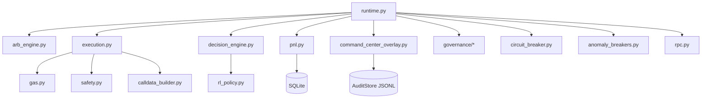
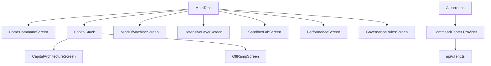

# Module Dependency Graph

This document describes **high-level module dependencies**. The goal is to keep debugging and maintenance tractable under high cognitive load.

## Backend (RuntimeBundle)

## Mobile

## Design Rule
Stable core modules must not import experimental overlays.
